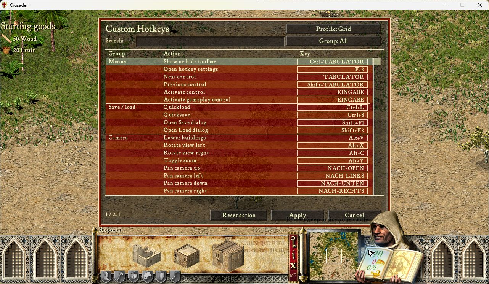
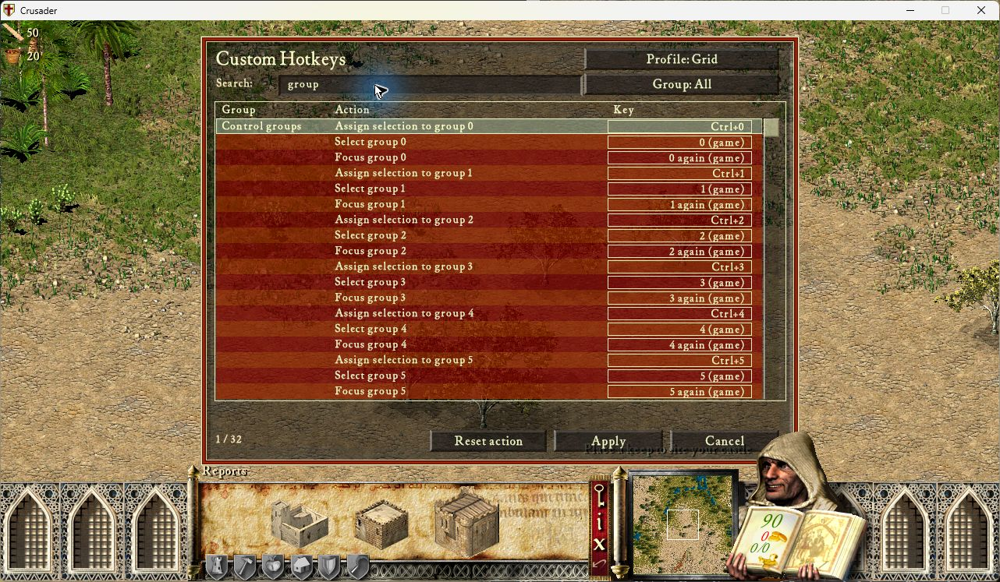

# Native editor check for 0.1.1

## Compact layout follow-up

Frozen `6a952f9c4d61e09aa1432f7f71744524fff38ec8`, ZIP87,776bytes,
SHA256 `2aec300003a8a059e235cd0ba5b72b9910b550577e3af35d4f75e59dbc6c933a`.
PID7852, same executable/dependencies/configuration/language/resolution as below.
The revised editor shows18 rows, aligned equal-width Profile/Group buttons,
a recessed search field and one footer row for counter/Reset/Apply/Cancel.
No Change/Clear buttons, Enter/Delete hint or selection-explanation line remains.
Key glyphs are one further pixel lower; other non-button labels are two lower.
The ordinary button captions retain their original native position.

F12 opened the editor in A Mighty Oasis. Clicking Search showed the caret;
typing `group` filtered live through119/50/33/33/32 results. Enter accepted
without starting capture; the next Enter started capture for assignment0.
Ctrl+F11 displayed correctly, Delete cleared it, and the relocated Reset action
restored Ctrl+0. Cancel closed without saving. The viewport showed no camera
change during those search/edit steps; no native command-count claim is inferred.
Some immediate captures caught partial painting; fresh observations showed all
rows intact. Both current screenshots below are stable, unedited PID7852 captures.

474 component cases passed19.15s (Lua5.4/LuaJIT), including live search, focus,
Enter/Tab/Escape, clearing and reset. Native search Escape/Tab and all supported
languages/minimum resolution are not established by this bounded visual run.
Error log header-only. Normal Alt+F4 exit/process absence verified; desktop
released05:12:33 CEST12 September2026, baseline configuration restored. Saved
profiles unchanged. Task receipts `compact-011-build.json`, `compact-7852*.log`.

An earlier alignment-only PID27508 run on d981d05 also checked the new text
baselines; it was closed and released05:03:18 before this layout implementation.

## Earlier capture and persistence check

Frozen source `21dab2a79b84e0aaffb2c770681281675969f1d4`, ZIP88,172bytes,
SHA256 `2f1eb40cef2b2a6352d2db9c6adb9d1c08cdbff2a2b4d29626c91e5c5ffb0db0`.
PID13032 on12 September2026, SHC1.41 executable SHA256
`3bb0a8c1e72331b3a30a5aa93ed94beca0081b476b04c1960e26d5b45387ac5a`,
UCP3.0.7-77c6a/UI1.0.1/LuaJIT1.0.0/cffi1.0.0/winProcHandler1.0.0/graphics1.3.0.
English game, German Windows keyboard names,1280x720. Only the packaged product
and its dependencies were active; no input diagnostic, Legacy or Recorder.
Configuration SHA256:
`102127fb28710431772a3c314f3fe2dc2fb77bbe68427dfef07b704142b361e3`.

- F12 opened the editor with the persisted Grid profile and211 actions.
- Clicking Change key for Show or hide toolbar entered capture. Ctrl+F11
  appeared correctly; Apply saved generation3 with scan87,extended=false,mods1.
  Reopening showed that saved binding. No other key was captured by release.
- Capturing F12 for that action reported the existing settings-action conflict
  and retained Ctrl+F11. Reset action restored Ctrl+Tab; Apply saved generation4.
- Castle Builder / A Mighty Oasis was started using mouse setup. F12 opened the
  gameplay editor. Native row/button rendering remained intact. Key glyphs now
  clear the top border; all sixteen action rows remain visible.
- Two PageDown presses kept keyboard focus visible across section boundaries.
  The control-group section showed assignment, select and focus together,
  with `0 (game)` / `0 again (game)` through the visible group3 and explanatory
  help. This is a display check, not a new native group-command-count test.
- The Group button filtered to the six menu actions. Home and Return entered
  capture without binding the triggering Return. Ctrl+Up displayed the extended
  arrow name correctly. Cancel discarded this edit; F12 reopened with Ctrl+Tab.
- Normal Alt+F4 closed the game; process absence verified. Desktop released
 04:44:13 CEST, approximately four minutes after acquisition. Baseline UCP config
  restored. Saved Grid bindings are back to their defaults; task evidence retains
  both persistence generations. No world save or other worker's process changed.

Input used the user-requested physical-scan SendInput harness, not physical
hardware. The error log is header-only. Task evidence: `editor-011-build.json`,
`editor-13032{,-error}.log`, `editor-13032-profiles-{a,b}.json`, and capture/conflict/
extended-key JPGs under Roadmap/Investigations/Custom-Hotkeys/native-evidence.
The screenshots below are original, unedited game-window captures.

472 component cases passed on Lua5.4/LuaJIT in19.94s before this run. New checks
cover group completeness/order/filtering/scrolling, all three presets' retained
number paths without custom dispatch, modifier/physical-position/E0 capture,
release/repeat/character suppression, draft isolation and localized font bytes.
This bounded check does not replace full keyboard-only, multiplayer, replay,
state-restore, language/layout or performance acceptance.
