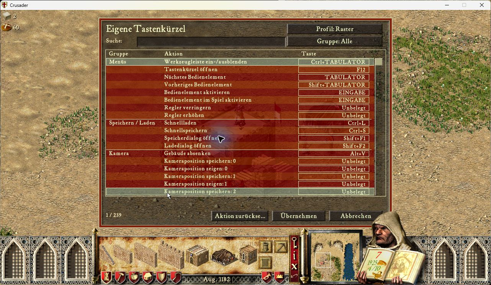
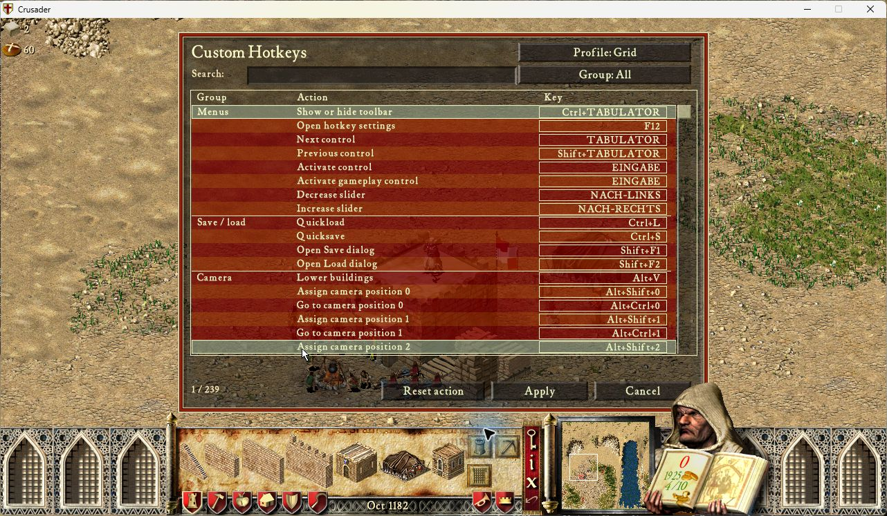

# Custom Hotkeys 0.1.7

The preview retains the complete 0.1.6 action set: three presets, in-game
rebinding and persistent profiles, keyboard and mouse bindings, building and
unit groups, camera bookmarks, keyboard targeting, and native Options and
Automarket navigation. See [the feature inventory and earlier native receipts](features-0.1.6.md).
Multiplayer, Recorder and Automarket remain available for testing.

This revision removes the redundant protected closure from each editor row and
unused menu-reader state. The existing protected render callback still owns
error handling. It also hides the native world-hover banner while the hotkey
editor owns the screen, using the game's display-element getter/setter resolved
once by UCP. Restoration follows the same screen and Recorder input generation;
the extension does not restore old display state into a replacement world.
See [the binding and reuse review](native-bindings.md).

## Exact tested package

- Runtime: `2ed6d48274261923081b7e9e9e0138b651977c4f`.
- ZIP: **112,151 bytes**, SHA256
  `0c1d2ff48f45be2a1152363a2983303bd724f39dcccb30c7f15f863585285d98`.
- **605 component tests passed** on Lua 5.4 and LuaJIT 2.1. Exact-runtime CI passed.
- Actual UCP AOBExtract resolved **171 named bindings / 155 unique patterns**
  on each available Crusader and Extreme 1.41 fixture. These are binding results,
  not complete native acceptance of every executable variant.

## Loaded game language, exact packaged runtime

PID5648 used an English SHC 1.41 executable with the German `CR.TEX` fixture
(SHA256 `6716ffe38391012f04ce32017eb65e52eeddbeb4acc76268d726786c8bfb9dc3`).
Recorder 0.50.4 and Automarket 1.1.0 were loaded. The main entry, F12 editor and
239-action gameplay editor rendered German labels, including accented letters.
Keyboard search for `kamera` returned 24 actions; F12 did not interrupt text
entry. Keyboard Cancel, main Options and Load reached the task quickslot.
No profile changes were applied. Existing profiles preserve their old bindings;
new optional actions remain unbound until reset or individually assigned.

The game closed normally, PID absence was verified, and the desktop was released
at 19:23:29 CEST. Game text, configuration and profile files were restored
byte-for-byte. The error log contained only its header. This was not a finalized
Recorder session or native non-Western font/IME test.

The language correction reads the existing UI TextManager marker and codepage,
removes the two-codepage startup restriction, adds five missing catalogs, and
uses the existing UTF-8 edit model for clipping/caret boundaries. Windows API
conversion checks cover eight codepages. See [localization and reuse](localization.md).

## Earlier native SHC checks, 12 September 2026

The earlier hover-only runtime `83990c3` (101,614 bytes; SHA256
`d2ae2fecb9a838fcd498db2eff122943d0903c7ace9a353945f613975624878d`)
was tested separately. PID7116 used Crusader 1.41, UCP 3.0.7-77c6a, UI 1.0.1, Recorder 0.50.4 and
Automarket 1.1.0, with Grid selected and Legacy absent. The route from the main
menu through Options and Load to the task quickslot used keyboard input only.

| Check | Observed result |
|---|---|
| Hold Up, open F12 during the hold, release, then keyboard Cancel | Camera moved from `(384,1992)` to `(384,1923)` before the editor; it remained there after Cancel. All four sampled pan flags were zero. Placement, selection and active building category were unchanged. |
| Editor display | The 239-action editor opened without the world-hover banner. The screenshot below is the actual captured game window. |
| Save-name field | Typed `wasdx` and pressed F12 in native Save dialog10. The characters appeared in the name and F12 did not open the editor. Camera, selection, placement, rotation and category remained unchanged; dialog10 retained text ownership. The name was not saved. |

The hold receipt contains each key-down and key-up. The Save field initially
reached its native width limit; the test shortened the name before verifying the
full `wasdx` sequence. This does not establish unrestricted field length or
character composition support. Native display restoration still needs an
explicit follow-up observation; the component suite covers restoration and
screen/world replacement cases.

The prior cleanup-only build `9588173` restored the task game's sound settings
to Sound Off and all three volumes zero, and reproduced the stale hover banner
that prompted this fix. It is not the package above. Neither of these runs
finalized a Recorder session. The earlier four-command playback with matching
resource, RNG and full RNG checkpoints remains evidence for its recorded
`46556be` runtime, as documented in the 0.1.6 evidence.

## Remaining acceptance

Two-PC multiplayer is deferred to manual testing by the user and does not lock
features. Full keyboard-only acceptance, map-description/map-name/chat text,
the full held/focus/mouse matrix, alternate-profile replay and state restoration,
native high-speed simulation, expanded Extreme gameplay and additional
executable/language fixtures remain outstanding. All nine Store descriptions
and eleven game-language catalogs are present; fluent review and native font coverage beyond the observed English/German
menus are not established. The PR stays a development preview pending the applicable
acceptance and normal review; no verified merge or overall completion is claimed.
