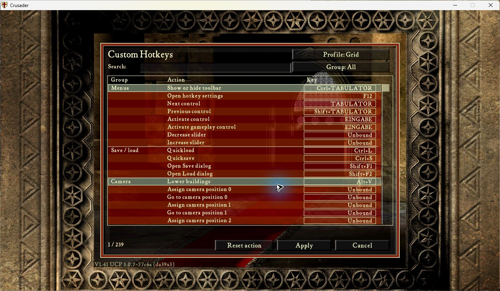

# 0.1.8: shared runtime ambiguity checks

All 155 instruction patterns now use UCP's shared uniqueness APIs during module
preparation, before publishing addresses, reading captures or installing hooks.
UI-owned exports remain reused. No module-private scanner, PE parser, cache,
fixed-address fallback or additional gameplay/Recorder activation gate exists.

The checks exposed an overlapping `playerLord` signature missed by the old
offline verifier. Its identifying short-branch context is now stronger. The
corrected overlapping-match audit resolves the same 171 expected bindings on
all six local/official EFIGS and Polish Crusader/Extreme executables.

## Required shared changes

[RPS PR16](https://github.com/gynt/RuntimePatchingSystem/pull/16) corrects native
scan bounds, short/final ranges and guard handling. It exposes first/second
matches in executable main-image pages, including overlapping and cross-region
matches, through its existing scanner/parser. [UCP PR149](https://github.com/UnofficialCrusaderPatch/UnofficialCrusaderPatch3/pull/149)
reuses its AOB cache and capture decoder. Only successful uniqueness validation
updates the shared cache, including a stale or non-code cached entry.

These prerequisites are not yet released. Do not distribute the 0.1.8 module
as a standalone stock-3.0.7 update. Its final minimum framework dependency must
be declared when that framework version is assigned. Public 0.1.7 ZIPs and the
Store recipe remain unchanged; their earlier uniqueness claim is superseded.

## Validation on 12 September 2026

- 611 component tests passed; 38 final resolver/package/locale checks passed.
  Each of 155 binding failures is exercised before publishing any addresses or
  registering callbacks, on Lua 5.4 and LuaJIT.
- Seven shared-framework tests use the actual cache, facade and capture decoder.
  RPS native x86 regression tests and four tests in its existing lunatest suite
  cover bounds, cache-independent uniqueness, overlaps and Lua API results.
  Full Debug/Release RPS builds and regression CI pass at `e958409`.
- Six real executable fixtures pass all 155 overlapping-match uniqueness checks
  and retain all 171 expected resolved values.
- Native Crusader PID23580 and Extreme PID5964 both initialized Hotkeys 0.1.8 and
  opened the 239-action main-menu editor with physical F12 input. Error logs
  contain only their headers. Both games closed normally; the desktop was
  released at 20:58:44 CEST and original test framework/config/cache/profile
  files were restored byte-for-byte.
- Logged module preparation took 0.744s in Crusader and 0.598s in Extreme. This
  includes module preparation, not just scanning; it is not an isolated benchmark.
  Binding resolution runs once, with no per-frame or simulation-speed cost.

Native artifact: source `89cc712eea712a85d4341fcf038a279398020f23`, 112402 bytes,
SHA256 `1bc05d0d610dd2982db5009372568debf5700c727d846aea7d410a55a9ef148f`.
Native stack: stock UCP 3.0.7 DLL, RPS production `604174b` (later commits add
tests only), and the three framework Lua files from `1d78391`. This is not a
complete new framework distribution acceptance result. Recorder0.50.4 and
Automarket1.1.0 were loaded; gameplay/replay were not exercised in these runs.

Full gameplay/text/focus, two-peer multiplayer, replay/state restore, high-speed
simulation and normal reviewed merge remain outstanding under the original
mission. The user deferred two-PC testing to manual acceptance.
