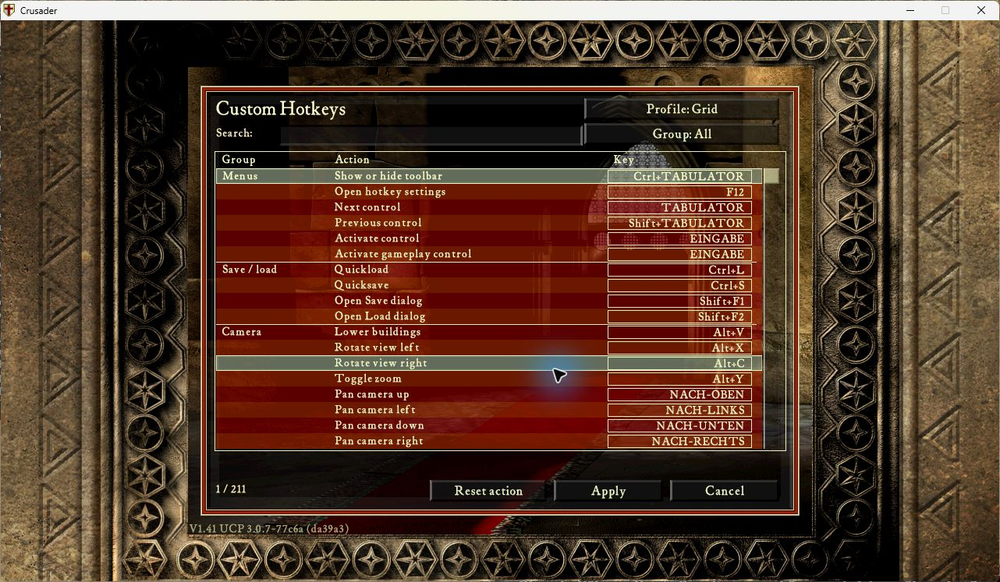

# Multiplayer preview 0.1.3

At the user's request, multiplayer acceptance no longer disables development
testing. The same action catalog, original-shortcut conflict rules, local camera
hold and native world-action adapter accept `live-mp`. The resolver recognizes
synchrony mode 1 alongside solitary 0 and skirmish 99, and rejects finished modes
2/666. These values correspond to OpenSHC's `Game/GameMode.hpp` and the synchrony
field at 0x191DD80 (GameSynchronyState base 0x191D768 + 0x618).

No new native hook, queue, simulation write or input polling was introduced.
Stance still calls the original validated command submission wrapper; control
activation and targeting still use native mouse handling. Current local player,
selection ownership, synchronization status, pause, modal, text editor and focus
checks remain active. Recorder's public lifecycle API still blocks live input
through playback and state restoration, including when recorded mode is MP.

The existing quicksave/quickload and Save/Load dialog shortcuts remain SP-only:
their ordinary dialog workflow cannot replace multiplayer's session owner.
Use the game's normal multiplayer save/load controls. This is an action-specific
native restriction, not a multiplayer activation switch.

Component tests cover multiplayer catalog availability, native stance dispatch
once, foreign selection rejection, text/modal/focus restrictions and cancellation
of local lowering on replay entry. They do not prove two-peer synchronization.
Native multiplayer and complete keyboard workflow acceptance remain pending;
testers can now run the [two-PC checklist](manual-multiplayer.md).

All nine Store language descriptions have the new version, multiplayer testing
status and paired Recorder 0.50.4 requirement. All game-language catalogs are
checked for complete English-key coverage without fallback; native building and
control names continue to come from the game's own localized text. Three fallback
labels (Text, Back, Change selected binding) now have French, Italian, Spanish and
Polish translations. Fluent review and native rendering in every language remain
separate acceptance work.

Native load check, 12 September 2026: exact 0.1.3 ZIP at source 7c142118, SHC
1.41 / UCP 3.0.7-77c6a, Recorder 0.50.4, Automarket 1.1.0, protocol and
map-extensions 1.0.0, UI 1.0.1 and pinned native dependencies. PID2772 reached
the main menu; a scan-code F12 press opened the 211-action Grid editor. Mouse
Cancel returned to the main menu; Alt+F4 exited normally. Error log contains
headers only. Process absence was checked before releasing the desktop at
07:21:29 CEST; configuration and both profile slots were restored byte-for-byte.
This verifies packaged startup/editor access, not multiplayer gameplay or every
language. Earlier PID17648 was rejected by SHC's single-instance check because
another worker's game was open; it is not counted as a native pass.

