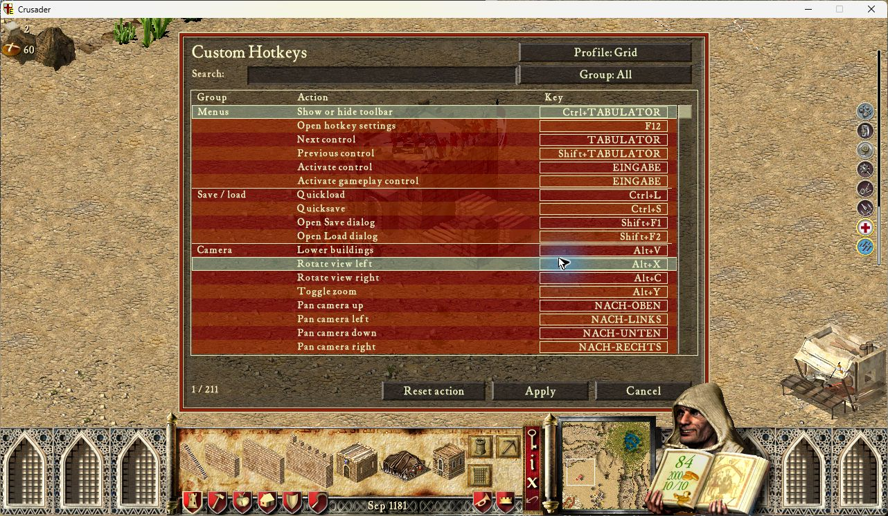

# Native bindings and button activation

The 0.1.5 refactor removes the executable SHA256 allowlist and all absolute
runtime game addresses. `address_bindings.lua` resolves named functions and data
through UCP's cached `core.AOBScan` and `utils.AOBExtract` during preparation,
before enable-time hooks. The UI dependency supplies its existing mouse state,
hit-test function and button surface. The dedicated LuaJIT state receives one
copy of these bindings; input dispatch performs no scans or remote address reads.

Native structure fields retain their ABI offsets. The viewport rectangle offset
is extracted from the original setup function; menu arrays are extracted from
their constructor calls. No address is inferred from a whole-image relocation
delta, and no reference-address fallback is used when a signature is absent.
The obsolete filename, working-directory and whole-file hash checks are removed.

Building/category/Grid shortcuts queue the active enabled control's existing
cdecl callback and parameter. At the input frame, ownership and control identity
are checked again. The pending action is cleared before entering game code, so
callback re-entry cannot submit it twice. No placement ID is written and no
mouse gesture is generated for simple buttons. The original toolbar handler
retains tutorial, player and game-state validation; actual placement still uses
the normal native validated command path.

Positional sliders and explicit keyboard world targeting still use the native
mouse-input adapter. Traversal navigation can move the pointer to show focus;
direct building and Grid selection do not. Recorder input ownership notifications
and the shared winProcHandler chain remain in use. Legacy source is unchanged.

## Verification

The actual UCP AOBExtract utility resolved all 169 bindings against both local
Crusader 1.41 (`3bb0a8c1…`) and Extreme (`55648e6b…`) images. Each of the 153
scanned patterns had exactly one match in each mapped image; all reference
results equal the previously audited addresses. Three bindings reuse UI exports;
the remaining fields derive from their structure owners. Group stride, unit
capacity, tribe stride/capacity and selection-bitset length are extracted from
the original group-clear, tribe-clear and tribe-selection routines. Extreme uses
10,000 unit entries, 80,000 bytes per group, a 1,672-byte tribe stride and a
1,250-byte selection bitset; the corresponding Crusader values are 2,500,
20,000, 820 and 400. Both use 1,250 tribe slots. This is offline
resolution evidence, not complete native or multiplayer acceptance.

Component tests cover a relocated input hook, cursor-free activation exactly
once, callback re-entry, hidden/replaced controls, focus/text/modal changes,
physical mouse takeover and cancellation.

Native Crusader PID23876: F12 opened the Grid editor. A selected a keep without
moving the cursor (801,172); a normal click placed it. After placing a granary,
W changed category10 to20 and S selected woodcutter placement51; cursor(564,281)
and camera(2772,1864) were unchanged. Normal woodcutter placement reduced wood
45 to42. No mouse-button debt remained. Closed normally; desktop released.

First Extreme run PID27628: module initialization and F12 editor passed. F12
did not interrupt the native initial title field. Construction exposed a context
bug: modal130 is Extreme's nonblocking tactical-powers bar, not a modal dialog.
The shared background-layer predicate now recognizes that HUD only on world
screens; text fields and actual dialogs still retain input ownership.

Extreme retest PID33956, source `f4f56ec`: F12 opened the editor in gameplay.
With the tactical-powers HUD active, W changed category10 to20 and S selected
woodcutter placement51. Cursor(929,540), camera(224,2024) and all sampled mouse
button flags stayed unchanged. A normal click placed the woodcutter, reducing
wood100 to97. An earlier W during the AI message overlay (secondary modal19)
was rejected. The error log contained only its header. Both Recorder0.50.4 and
Automarket1.1.0 were loaded. Normal exit/PID absence verified; desktop released
15:10:11 CEST and configuration/profile baselines restored byte-for-byte.

The initial Crusader check used `0970e02`; the Extreme correction additionally
extracts layout sizes instead of assuming Crusader's smaller arrays. The exact
Extreme-tested ZIP is 94,158 bytes, SHA256
`5fabd7777d246aaf61ee99bc92a9b949e992a87723073fa23c6cef972258fe40`.
The corrected component suite passed 515 tests on Lua5.4/LuaJIT.
These checks do not establish full multiplayer, command-count, replay,
high-speed simulation or complete keyboard-only acceptance.

## Reuse and remaining ownership boundaries

Inspected framework `02a7a6b`, UI1.0.1 `d3a807c` and winProcHandler1.0.0
`5f85672`. The tested installation uses UCP3.0.7-77c6a; its actual utilities
were used by offline verification. Separately owned branches were not edited.

| Capability | Existing implementation used / demonstrated boundary |
|---|---|
| Discovery/patches | Framework core.AOBScan/insertCode and utils.AOBExtract; data/cache.lua owns caching. No extension scanner or fixed-RVA fallback. |
| Windows input | winProcHandler RegisterProc/CallNextProc via core.openLibraryHandle; framework proxy limitation tracked in UCP3#147. |
| UI | ui/menu.lua, ui/modalmenu.lua, ui/game.lua, manager.lookupMenu; Automarket ui/automarket.lua demonstrates the same rendering and hit-test exports. |
| Button activation | UI MenuItem callback union/parameter; current enabled row invokes the original native handler. UI has no higher-level keyboard activation API. |
| Input frame/mouse | UI mouseState/isMouseInsideBox reused. UI1.0.1 has no before-input subscription or mouse-update/reset API. The single existing Hotkeys insertion uses UCP insertCode and preserves displaced instructions. A shared callback API remains an owner integration point. |
| Skin/text | Existing UI button/text/border exports. Table-cell rendering and text measurement are not exported; named native bindings supply those primitives. |
| Gameplay | UI has no save/load/camera/selection service; native handlers retain these responsibilities. No copied command executor. |
| Profiles | Framework normal-file io.open; two-slot recovery because it exposes no atomic replace. Separate userdata proposal: UCP3#142/#131. |
| Language | Framework data.version.getGameLanguage after native game initialization. |
| Replay | Optional Recorder observer/read contract in its separate owner PR; no copied loader, tick or restore implementation. Tester-mode input stays unrestricted. |

Final-diff review removed obsolete executable/identity adapters and production
reference-address literals. Simple building/category/Grid actions no longer use
positional click transport. Sliders, traversal focus and explicit world targeting
still require the native cursor adapter. Bindings resolve once before enable-time
patches and copy once into LuaJIT, with no input-frame scans or remote lookups.

## Compatibility limits

Framework data/version.lua detects native version and Extreme markers; the module
declares SHC1.41 and SHCE1.41 rather than an exact file identity. The two local
PEs above are the tested matrix. Other language/distribution variants still need
fixtures and native acceptance; AOB matches alone do not prove compatibility.

All 153 patterns were unique in both fixtures. Missing matches propagate UCP's
initialization error before hooks. UCP3.0.7 returns the first match and exposes
no uniqueness assertion; runtime ambiguity diagnostics remain a framework API
gap, not a claimed protection in this preview. Occupied input sites are rejected
by the displaced-byte check. No executable-hash or Recorder lock was restored.
