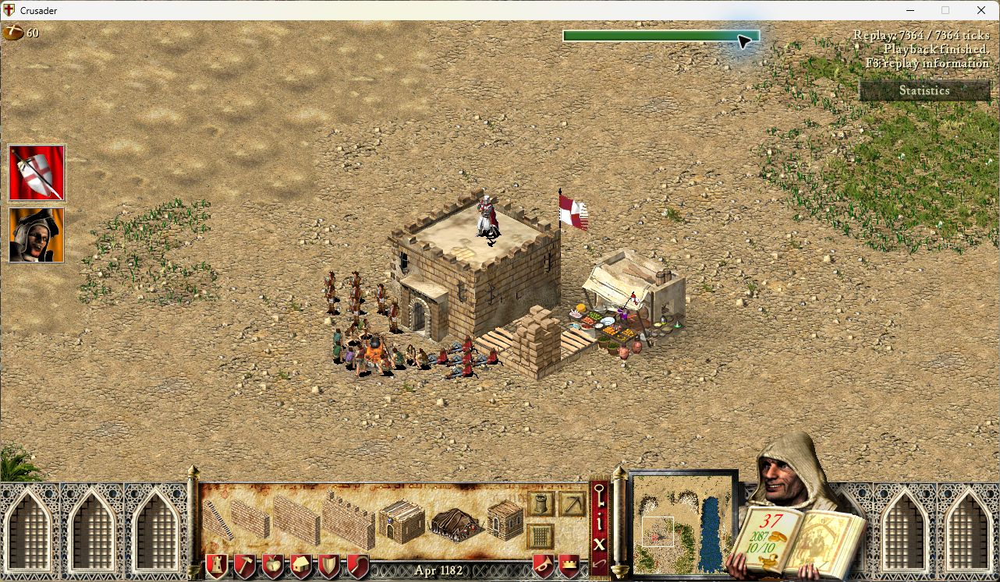
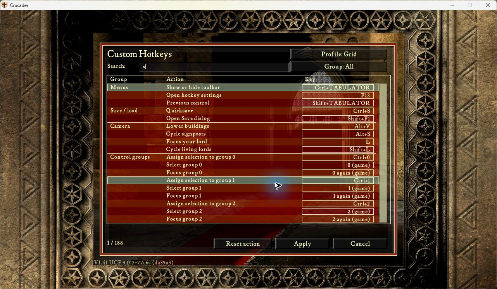
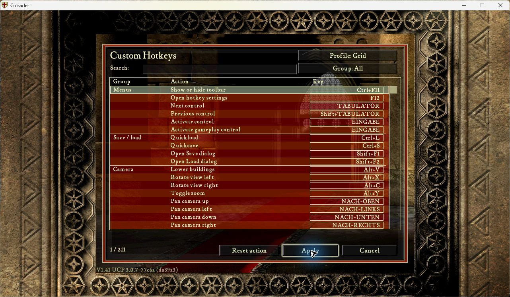

# Recorder integration in development

Historical 0.1.2/0.1.3 contract below. The user-requested
[0.1.4 tester build](unrestricted-preview.md) makes the API optional and removes
Hotkeys' playback input lock; those earlier protection claims do not apply to it.

Custom Hotkeys now uses Recorder's input lifecycle API version1 rather than
rejecting Recorder by name. Recorder remains optional. When enabled, it must
expose the verified API and finish startup before Hotkeys installs its hooks.
Recorder0.50.3 and older do not expose this API; the prerequisite implementation
is on `feat/custom-hotkeys-input-state`, based on Recorder PR46 commit02014385.
Review: [Recorder input API PR](https://github.com/Krarilotus/ucp_recorder/pull/2),
[upstream issue48](https://github.com/Corax34/ucp_recorder/issues/48).

Each scene resolution reads current Recorder input ownership. Playback, paused
playback, loading, seek/restore, finished/error playback and unknown API states
disable custom dispatch. The synchronous transition observer invokes the same
router barrier used by focus loss, cancelling capture, pending clicks, quickslot
operations and owned camera/lowering holds before world replacement. Generation
also participates in context identity and quickslot tokens. Held input cannot
reactivate until a fresh press. No additional simulation/replay hook is installed.

Recording continues to accept native commands through the existing validated
path. Automarket1.1.0 retains its existing protocol1.0.0/map-extensions1.0.0
Recorder adapter. Its settings command is captured once; weekly simulation
trades must not be injected again by Hotkeys or Recorder.

Native combined checks on 12 September 2026 used Hotkeys 0.1.2 source
`5a6d771f29fc93d500e85ebe9755c2ed5c4721a3`, Recorder 0.50.4 source
`8dfb61e7b44c619d804265da790c452b66245ad9`, SHC 1.41 executable SHA-256
`3bb0a8c1e72331b3a30a5aa93ed94beca0081b476b04c1960e26d5b45387ac5a`,
UCP 3.0.7-77c6a, UI 1.0.1, Automarket 1.1.0, protocol 1.0.0 and
map-extensions 1.0.0. Legacy was absent; diagnostic hooks were disabled.

* Recording `20260912-035957-0001`: zero player commands, finished at tick 2514
  with matching resources, RNG and full-RNG checkpoints. Native backward restore,
  pause and forward seek worked. F12 during playback, Ctrl+S while paused and
  Ctrl+L while seeking did not open the editor or a live save/load operation.
* Recording `20260912-041421-0001`: four native commands (two selection commands,
  one market placement, one 272-byte Automarket commit). Grid W opened the native
  industry menu during recording. Automarket sold wood down to 8, leaving 2087
  gold. Playback finished at tick 7365 with all four commands and matching
  resources, RNG and full-RNG checkpoints. F12 and Ctrl+L were suppressed during
  playback/forward seeking. The commit appeared exactly once in the journal.

These checks establish this single-player composition and the recorded trade;
they do not prove every Hotkeys command or a keyboard-only gameplay route.
The exact published Hotkeys archive was retested in PID21560 without diagnostics:
F12, Shift+Tab twice and Enter activated search; physical S filtered 211 entries
to 188; Enter accepted the field, the next Enter entered capture, and Ctrl+F11
was recorded correctly. Apply/reopen preserved the binding. Keyboard navigation
to Reset then Apply restored Ctrl+Tab. This checks the editor from the main menu
with Recorder/Automarket loaded, not a complete live-game keyboard route.
Earlier mouse attempts had not established field activation; the final keyboard
route resolved the uncertainty without a production code change.
Held-key restore, changed-profile playback,
command-bearing backward restore and 1100-speed performance remain acceptance
gaps. The final Recorder component suite passed 472 tests (one skip, 3189
  subtests); Hotkeys component results are recorded in the implementation PR.

Multiplayer assessment: Hotkeys reuses native submission rather than modifying
simulation state; Recorder already validates Automarket protocol ID, payload
size, owning player, flags and fee. This is a sound basis for integration, not
evidence of two-peer synchronization. The 0.1.2 preview tested here rejected
multiplayer. The later [0.1.3 preview](multiplayer-preview.md) enables live MP
testing at the user's request. Physical two-PC testing is deferred to the user;
identical extension/protocol versions and command-count/state-checkpoint
comparisons are required for acceptance.

Native receipts: [package/source hashes](recorder-native-build.json),
[four-command journal](recorder-automarket-commands.json), and
[finished playback checks](recorder-automarket-playback.json).

All test games exited normally; process absence was checked before final
desktop release at 06:49:52 CEST. Temporary task-only logging was removed before
the exact-archive editor retest. No desktop reservation is held for review.

