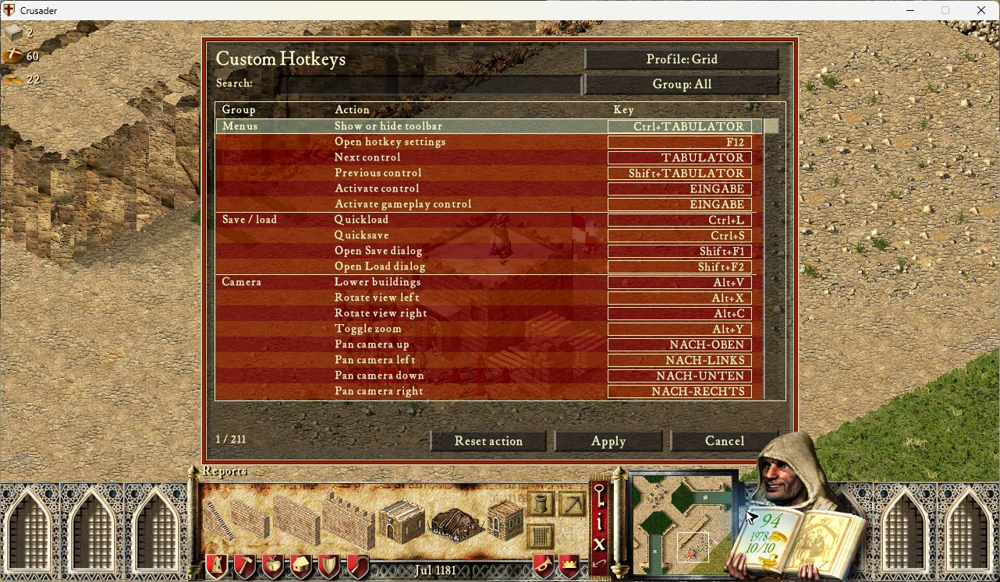
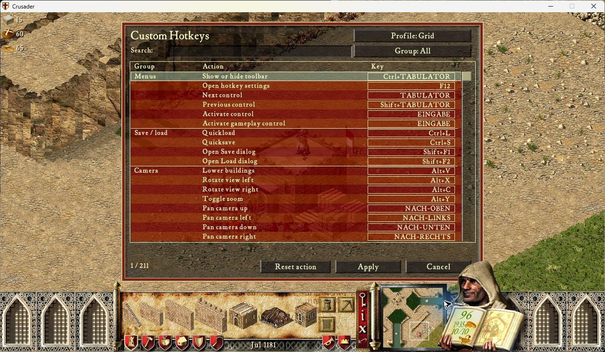
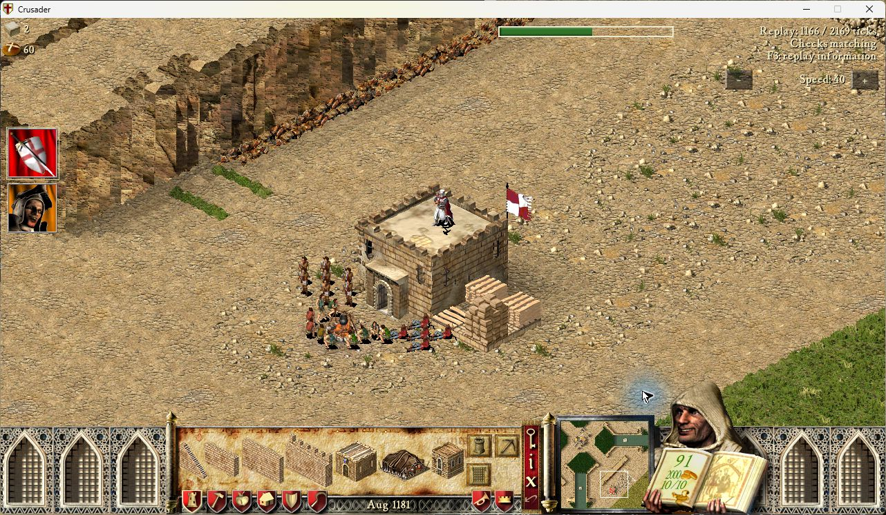

# Integration tester build 0.1.4

Historical evidence for 0.1.4. The current [0.1.5 binding refactor](native-bindings.md)
retains this tester-mode policy and replaces the fixed native bindings.

At the user's explicit request, Hotkeys no longer treats missing Recorder
integration acceptance as a reason to block startup or input. Multiplayer is
enabled, Recorder's version/API is no longer an activation requirement, and
Hotkeys no longer consults Recorder's `blocked` flag during playback, pause or
restore. Existing native game/control eligibility determines which actions run.

Recorder lifecycle notifications are optional. When present, they cancel old
held gestures at world transitions and provide a generation counter. Fresh
input is available afterward, including during playback. Without that API,
ordinary native screen/modal/focus transitions still apply. No Recorder code or
simulation pipeline is patched by this change. This build does not guarantee
read-only replay interaction; testers should report live-input/replay conflicts.

The known Legacy hotkey conflict remains resolved through the required
`o_keys.enabled=false` configuration. Text-entry ownership, actual visible
controls, native save/load availability and the SHC 1.41 native ABI still apply;
they define correct action routing rather than whether testing is permitted.
Mouse rebinding, building groups and camera bookmarks remain unfinished features,
not hidden functionality unlocked by this change.

The nine localized Store descriptions reflect this behavior. Component checks
cover absent/older/partial Recorder APIs, copied generation values and fresh
input after a transition reporting `blocked=true`. Earlier 0.1.2/0.1.3 replay
protection evidence describes those builds and is not a claim about 0.1.4.

486 component checks passed on Lua 5.4/LuaJIT; after removing obsolete activation
messages and updating descriptions, all 42 affected localization/module/metadata
checks passed again. Native multiplayer and complete feature acceptance remain
pending, without disabling the available implementation for testers.

Native check, 12 September 2026: exact ZIP/source319ccf0, SHC1.41/UCP3.0.7,
Recorder0.50.4/Automarket1.1.0 with their pinned dependencies. PID25780 recorded
a fresh SP fixture, opened the editor with scan-code F12 while recording, quit
through native Game Options, then replayed that recording. F12 opened the editor
during active playback. Cancel returned to playback at tick1166/2169 with
the Recorder HUD reporting matching checks. No bindings or world commands were
changed during this smoke test; playback was exited before its end. This is
not multiplayer or full replay/state-restore acceptance. Error log has headers
only. Normal exit and PID absence verified before desktop release07:55:01 CEST;
original config and profile slots restored byte-for-byte.

The older 0.1.2 fixture was rejected by Recorder's exact-asset verification;
its stored ZIP digest did not match the installed old archive. A fresh 0.1.4
recording resolved this test prerequisite without changing Recorder ownership.

